# Case Study #3 - Foodie-Fi

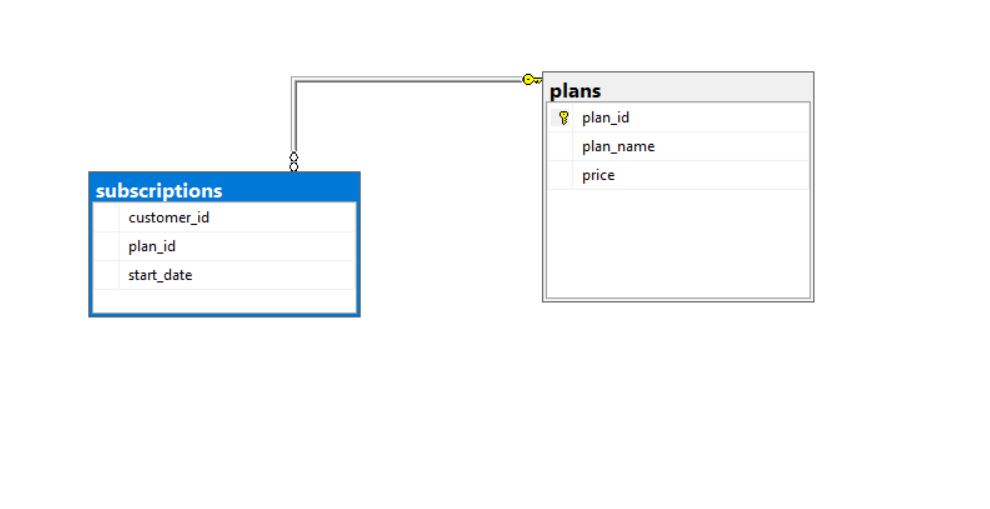

## B. Data Analysis Questions


### 1. How many customers has Foodie-Fi ever had?
```sql
SELECT Count(DISTINCT customer_id) AS total_customers
FROM   subscriptions
```
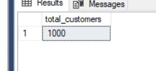

### 2. What is the monthly distribution of trial plan start_date values for our dataset - use the start of the month as the group by value?
```sql
SELECT Format(Dateadd(month, Datediff(month, 0, start_date), 0), 'yyyy-MM-dd')
       AS month
       ,
       Count(customer_id)
       AS customers
FROM   subscriptions
WHERE  plan_id = 0
GROUP  BY Dateadd(month, Datediff(month, 0, start_date), 0)
ORDER  BY Dateadd(month, Datediff(month, 0, start_date), 0)
```
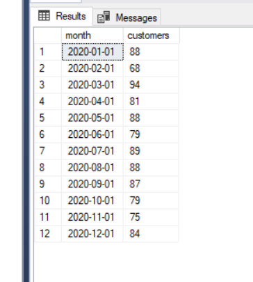

### 3. What plan start_date values occur after the year 2020 for our dataset? Show the breakdown by count of events for each plan_name?
```sql
SELECT plan_name,
       Count (s.plan_id) AS event
FROM   subscriptions s
       JOIN plans p
         ON s.plan_id = p.plan_id
WHERE  Datepart(year, start_date) > 2020
GROUP  BY p.plan_name
```
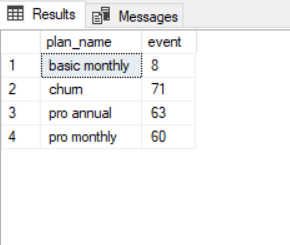

### 4. What is the customer count and percentage of customers who have churned rounded to 1 decimal place?
```sql
DECLARE @total FLOAT = (SELECT Count(DISTINCT customer_id)
   FROM   subscriptions);

SELECT Count(customer_id)                AS churned_customers,
       Count(customer_id) / @total * 100 AS churn_rate
FROM   subscriptions
WHERE  plan_id = 4
```
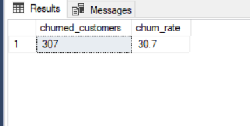

### 5. How many customers have churned straight after their initial free trial - what percentage is this rounded to the nearest whole number?
```sql
WITH churned
     AS (SELECT customer_id,
                CASE
                  WHEN plan_id = 4
                       AND Lag(plan_id)
                             OVER (
                               partition BY customer_id
                               ORDER BY start_date) = 0 THEN 1
                  ELSE 0
                END AS chrn_cnt
         FROM   subscriptions)
SELECT Sum(chrn_cnt)
       AS
       churned_customers,
       Floor(Sum(chrn_cnt) / Cast(Count(DISTINCT customer_id) AS FLOAT) * 100)
       AS
       churn_prct
FROM   churned;
```
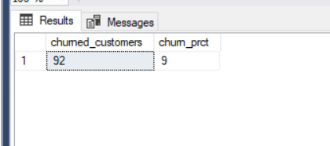

### 6. What is the number and percentage of customer plans after their initial free trial?
```sql
DECLARE @total FLOAT = (SELECT Count(DISTINCT customer_id)
   FROM   subscriptions);

WITH cte
     AS (SELECT plan_id,
                Row_number()
                  OVER (
                    partition BY customer_id
                    ORDER BY start_date) AS plan_order
         FROM   subscriptions s
         WHERE  plan_id <> 0)
SELECT p.plan_name,
       Count(c.plan_id)                AS initial_plan_cnt,
       Count(c.plan_id) / @total * 100 AS plan_perc
FROM   plans p
       JOIN cte c
         ON p.plan_id = c.plan_id
WHERE  c.plan_order = 1
GROUP  BY p.plan_name
```

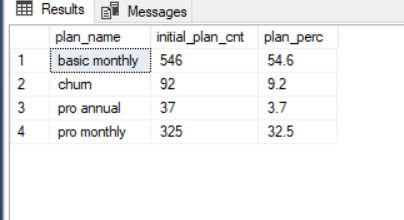

### 7. What is the customer count and percentage breakdown of all 5 plan_name values at 2020-12-31?
```sql
DECLARE @total FLOAT =
(
       SELECT Count(DISTINCT customer_id)
       FROM   subscriptions
       WHERE  start_date<='2020-12-31');WITH cte AS
(
         SELECT   customer_id,
                  plan_id,
                  Row_number() OVER (partition BY customer_id ORDER BY start_date DESC) AS last_plan
         FROM     subscriptions
         WHERE    start_date<='2020-12-31')
SELECT   p.plan_name,
         Count ( c.customer_id )              AS customer_cnt,
         Count (c.customer_id) / @total * 100 AS customer_perc
FROM     cte c
JOIN     plans p
ON       c.plan_id = p.plan_id
AND      c.last_plan=1
GROUP BY p.plan_name
ORDER BY Count (c.customer_id) DESC
group BY p.plan_name
```
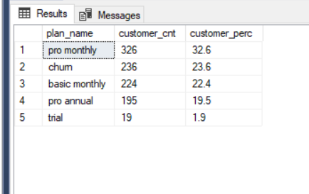

### 8. How many customers have upgraded to an annual plan in 2020?
#### a) Assuming trial is considered as upgradeable item
```sql
SELECT   p.plan_name           AS [plan],
         Count (s.customer_id) AS customer_cnt
FROM     subscriptions s
JOIN     plans p
ON       s.plan_id = p.plan_id
AND      s.plan_id = 3
AND      start_date<='2020-12-31'
GROUP BY p.plan_name
group BY p.plan_name
```
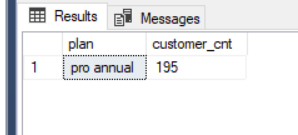

#### b) Assuming upgraded from monthly to annual excluding trial->annual upgrade
```sql
WITH monthly_subs
     AS (SELECT customer_id,
                plan_id,
                start_date
         FROM   subscriptions
         WHERE  plan_id IN ( 1, 2 )
                AND start_date <= '2020-12-31'),
     annual_subs
     AS (SELECT s.customer_id,
                s.plan_id,
                s.start_date
         FROM   subscriptions s
         WHERE  s.plan_id = 3
                AND s.start_date <= '2020-12-31')
SELECT p.plan_name           AS [plan],
       Count (a.customer_id) AS customer_cnt
FROM   monthly_subs m
       JOIN annual_subs a
         ON m.customer_id = a.customer_id
       JOIN plans p
         ON p.plan_id = a.plan_id
GROUP  BY p.plan_name
```
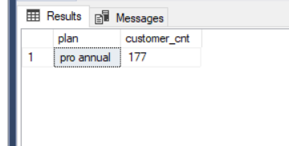

### 9. How many days on average does it take for a customer to an annual plan from the day they join Foodie-Fi?
```sql
WITH annual_subs
     AS (SELECT customer_id,
                plan_id,
                start_date AS ap_start_date
         FROM   subscriptions
         WHERE  plan_id = 3),
     customer_ap
     AS (SELECT s.customer_id,
                Datediff(day, s.start_date, a.ap_start_date) AS days_to_ap
         FROM   subscriptions s
                JOIN annual_subs a
                  ON s.customer_id = a.customer_id
                     AND s.plan_id = 0)
SELECT Avg(days_to_ap) AS 'Average days to annual plan'
FROM   customer_ap
```
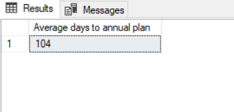

### 10. Can you further breakdown this average value into 30 day periods (i.e. 0-30 days, 31-60 days etc)
```sql
WITH trial_plan
     AS (SELECT customer_id,
                start_date AS join_date
         FROM   subscriptions
         WHERE  plan_id = 0),
     annual_plan
     AS (SELECT customer_id,
                start_date AS annual_start_date
         FROM   subscriptions
         WHERE  plan_id = 3),
     brackets
     AS (SELECT tp.customer_id,
                join_date,
                annual_start_date,
                Datediff(day, join_date, annual_start_date) / 30 + 1 AS bracket
         FROM   trial_plan tp
                JOIN annual_plan ap
                  ON tp.customer_id = ap.customer_id)
SELECT CASE
         WHEN bracket = 1 THEN Concat(bracket - 1, ' - ', bracket * 30, ' days')
         ELSE Concat(( bracket - 1 ) * 30 + 1, ' - ', bracket * 30, ' days')
       END
       AS period,
       Count(customer_id)
       AS total_customers,
       Cast(Avg(Datediff(day, join_date, annual_start_date) * 1.0) AS
            DECIMAL(5, 2)) AS
       average_days
FROM   brackets
GROUP  BY bracket
```
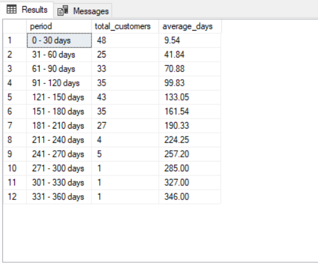

### 11. How many customers downgraded from a pro monthly to a basic monthly plan in 2020?
```sql
WITH cte
     AS (SELECT CASE
                  WHEN plan_id = 2
                       AND Lead(plan_id)
                             OVER (
                               partition BY customer_id
                               ORDER BY start_date) = 1 THEN 1
                  ELSE 0
                END AS downgraded
         FROM   subscriptions)
SELECT Sum(downgraded) AS 'total downgraded'
FROM   cte
```
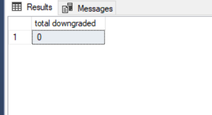
